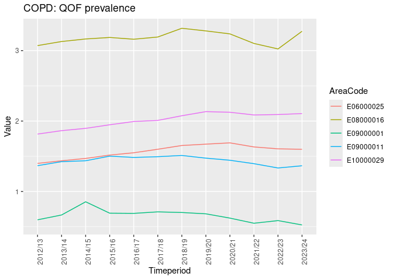
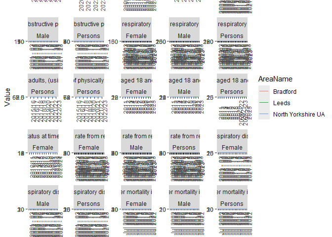
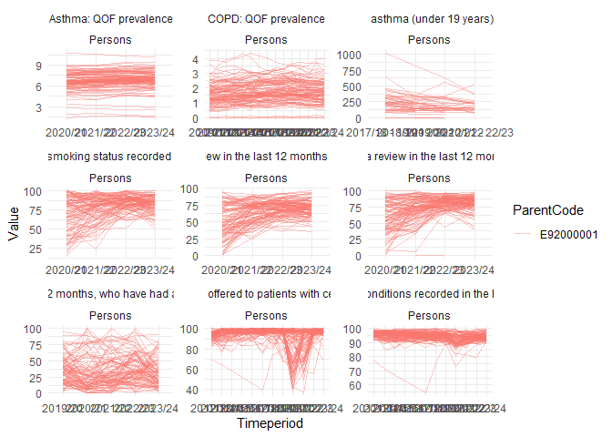

# Fingertips Data Exploration


``` r
remotes::install_github("rOpenSci/fingertipsR",
                        build_vignettes = TRUE,
                        dependencies = "suggests")
```

``` r
library(fingertipsR)
library(kableExtra)
library(tidyverse)
```

    ── Attaching core tidyverse packages ──────────────────────── tidyverse 2.0.0 ──
    ✔ dplyr     1.1.4     ✔ readr     2.1.5
    ✔ forcats   1.0.0     ✔ stringr   1.5.1
    ✔ ggplot2   3.5.1     ✔ tibble    3.2.1
    ✔ lubridate 1.9.4     ✔ tidyr     1.3.1
    ✔ purrr     1.0.4     
    ── Conflicts ────────────────────────────────────────── tidyverse_conflicts() ──
    ✖ dplyr::filter()     masks stats::filter()
    ✖ dplyr::group_rows() masks kableExtra::group_rows()
    ✖ dplyr::lag()        masks stats::lag()
    ℹ Use the conflicted package (<http://conflicted.r-lib.org/>) to force all conflicts to become errors

``` r
library(sf)
```

    Linking to GEOS 3.12.1, GDAL 3.8.4, PROJ 9.3.1; sf_use_s2() is TRUE

Downloading profile list

``` r
profile_lst <- profiles()
head(profile_lst)
```

    # A tibble: 6 × 4
      ProfileID ProfileName       DomainID DomainName                               
          <int> <chr>                <int> <chr>                                    
    1        18 Smoking Profile 1938132885 Key indicators                           
    2        18 Smoking Profile 1938132886 Smoking prevalence in adults             
    3        18 Smoking Profile 1938132900 Smoking prevalence in priority populatio…
    4        18 Smoking Profile 1938132887 Smoking related mortality                
    5        18 Smoking Profile 1938132888 Smoking related ill health               
    6        18 Smoking Profile 1938132889 Impact of smoking                        

Indicator list for Asthma domain (code `8000009`)

``` r
indicator_lst_asthma <- indicators(DomainID = 8000009)

indicator_lst_asthma |>
  kable()
```

| IndicatorID | IndicatorName | DomainID | DomainName | ProfileID | ProfileName |
|---:|:---|---:|:---|---:|:---|
| 90933 | Asthma: QOF prevalence | 8000009 | Asthma | 29 | Respiratory disease |
| 92780 | Hospital admissions for asthma (under 19 years) - registered population | 8000009 | Asthma | 29 | Respiratory disease |
| 93573 | Emergency hospital admissions for asthma in adults (aged 19 years and over) | 8000009 | Asthma | 29 | Respiratory disease |
| 93594 | Median length of stay (days) of emergency admissions to hospital for asthma in adults (aged 19 years and over) | 8000009 | Asthma | 29 | Respiratory disease |
| 93595 | Median length of stay (days) of emergency admissions to hospital for asthma (aged under 19 years) | 8000009 | Asthma | 29 | Respiratory disease |
| 93644 | Mortality rate from asthma | 8000009 | Asthma | 29 | Respiratory disease |
| 93790 | Patients with Asthma: review in the last 12 months (denominator incl. PCAs) | 8000009 | Asthma | 29 | Respiratory disease |
| 93791 | Patients with Asthma (6-19 yrs): Second-hand smoking status recorded in the last 12 months (denominator incl. PCAs) | 8000009 | Asthma | 29 | Respiratory disease |

Indicator list for Respiratory disease (code `29`)

``` r
indicator_lst_resp <- indicators(ProfileID = 29)

indicator_lst_resp |> 
  head(10) |> 
  kable()
```

| IndicatorID | IndicatorName | DomainID | DomainName | ProfileID | ProfileName |
|---:|:---|---:|:---|---:|:---|
| 253 | COPD: QOF prevalence | 8000003 | Key indicators | 29 | Respiratory disease |
| 1204 | Mortality rate from chronic obstructive pulmonary disease, all ages | 8000003 | Key indicators | 29 | Respiratory disease |
| 40701 | Under 75 mortality rate from respiratory disease | 8000003 | Key indicators | 29 | Respiratory disease |
| 90933 | Asthma: QOF prevalence | 8000003 | Key indicators | 29 | Respiratory disease |
| 92780 | Hospital admissions for asthma (under 19 years) - registered population | 8000003 | Key indicators | 29 | Respiratory disease |
| 93573 | Emergency hospital admissions for asthma in adults (aged 19 years and over) | 8000003 | Key indicators | 29 | Respiratory disease |
| 93574 | Emergency hospital admissions for pneumonia | 8000003 | Key indicators | 29 | Respiratory disease |
| 93575 | Emergency hospital admissions for respiratory disease | 8000003 | Key indicators | 29 | Respiratory disease |
| 93576 | Emergency hospital admissions for bronchiolitis in children aged under 2 years | 8000003 | Key indicators | 29 | Respiratory disease |
| 93577 | Emergency hospital admissions for COPD, all ages | 8000003 | Key indicators | 29 | Respiratory disease |

Selecting the codes for Respiratory profile

``` r
sel_indicator <- indicator_lst_resp |>
  pull(IndicatorID) 
```

Indicators are reported for different area types. The next code extracts
the area types for each indicator.

``` r
area_avail_ind <- do.call(bind_rows,lapply(sel_indicator,\(x) indicator_areatypes(IndicatorID = x)))
```

``` r
area_ty_lst <- area_types()
```

``` r
area_avail_ind_names <- area_avail_ind |>
  left_join(
    indicator_lst_resp |>
      select(IndicatorID, IndicatorName) |>
      unique(),
    by = join_by(IndicatorID)
  ) |> 
  left_join(
    area_ty_lst |> 
      select(AreaTypeID,AreaTypeName) |> 
      unique(),
    by=join_by(AreaTypeID)
  )

slice_sample(area_avail_ind_names,n = 15) |> select(-IndicatorID,-AreaTypeID)
```

    # A tibble: 15 × 2
       IndicatorName                                                    AreaTypeName
       <fct>                                                            <chr>       
     1 Median length of stay (days) of emergency admissions to hospita… ICBs, forme…
     2 Hospital admissions for asthma (under 19 years) - registered  p… CCGs (2021/…
     3 Under 75 mortality rate from respiratory disease considered pre… Government …
     4 Hospital admissions for asthma (under 19 years) - registered  p… Sub-ICB, fo…
     5 Median length of stay (days) of emergency admissions to hospita… ICBs, forme…
     6 Emergency hospital admissions for pneumonia                      England     
     7 Under 75 mortality rate from respiratory disease                 Upper tier …
     8 Smoking Prevalence in adults (aged 18 and over) - current smoke… NHS regions…
     9 Emergency hospital admissions for COPD, all ages                 England     
    10 The percentage of zero and one day emergency admissions to hosp… Sub-ICB, fo…
    11 Median length of stay (days) of emergency admissions to hospita… Sub-ICB, fo…
    12 Patients with Asthma: review in the last 12 months (denominator… Government …
    13 Emergency hospital admissions for COPD, all ages                 ICBs, forme…
    14 Hospital admissions for asthma (under 19 years) - registered  p… Primary Car…
    15 Mortality rate from chronic obstructive pulmonary disease, all … Upper tier …

Data for one indicator of the Respiratory profile

``` r
temp_data <- fingertips_data(
  IndicatorID = area_avail_ind$IndicatorID[1],
  AreaTypeID = area_avail_ind$AreaTypeID[1]
  )
```

``` r
# Code from vignette 
cols <- c("IndicatorID", "AreaCode", "ParentName", "Sex", "Timeperiod", "Value")

area_type_name <- table(temp_data$AreaType) # tally each group in the AreaType field

area_type_name <- area_type_name[area_type_name == max(area_type_name)] # pick the group with the highest frequency
area_type_name <- names(area_type_name) # retrieve the name

set.seed(1234)
samp_areas <- sample(temp_data$AreaCode |> unique(),5)


data <- temp_data[temp_data$AreaType == area_type_name & temp_data$AreaCode %in% samp_areas,
                  cols]
```

``` r
ggplot(data,aes(x = Timeperiod,y = Value, col = AreaCode ,group = AreaCode))+
  geom_line()+
  labs(title = area_avail_ind_names$IndicatorName[1])+
  theme(axis.text.x = element_text(angle = 90))
```



## Compiling a list of indicators from the Respiratory and Asthma domain that are available for lower and upper tier LA

``` r
indicator_lst_all <- bind_rows(indicator_lst_resp,indicator_lst_asthma)

sel_indicator_all <- indicator_lst_all |> pull(IndicatorID) |> unique()
```

The following code will extract the indicators that are available for
lower/upper LA

``` r
area_avail_ind_all <- do.call(bind_rows,lapply(sel_indicator_all,\(x) indicator_areatypes(IndicatorID = x)))

LA_ind_names_all <- area_avail_ind_all |>
  left_join(
    indicator_lst_all |>
      select(IndicatorID, IndicatorName) |>
      unique(),
    by = join_by(IndicatorID)
  ) |> 
  left_join(
    area_ty_lst |> 
      select(AreaTypeID,AreaTypeName) |> 
      unique(),
    by=join_by(AreaTypeID)
  ) |> 
  filter(str_detect(AreaTypeName,pattern = "(Upper|Lower|Practice|Sub-ICB)"))
```

## Spatial data

Spatial datasets for different areas have been extracted manually from
[geoportal.statistics.gov.uk](https://geoportal.statistics.gov.uk),
[www.data.gov.uk](https://www.data.gov.uk/dataset/5b656163-8b0f-441c-a26d-d59c0bba307f/sub-integrated-care-board-locations-april-2023-en-bsc),
and
[NHS](https://gp-catchments-data-download-nhsgisscw.hub.arcgis.com/).
Static copies have been stored on the releases of this repository for
full reproducibility.

``` r
files <- c("https://github.com/juanfonsecaLS1/fingertips-eda/releases/download/v0/Local_Authority_Districts_December_2023_Boundaries_UK_BFE_-2174146030568070774.gpkg",
           "https://github.com/juanfonsecaLS1/fingertips-eda/releases/download/v0/Upper_Tier_Local_Authorities_December_2022_Boundaries_UK_BFE_-8448860560432126468.gpkg",
           "https://github.com/juanfonsecaLS1/fingertips-eda/releases/download/v0/Sub_Integrated_Care_Board_Locations_April_2023_EN_BSC_-6830083509537628768.gpkg",
           "https://github.com/juanfonsecaLS1/fingertips-eda/releases/download/v0/GP_catchments_data.zip"
           )

lapply(files, \(f1) {
  n1 <- basename(f1)
  if (!file.exists(n1)) {
    download.file(f1, destfile = n1, mode = "wb")
  }
})
```

    [[1]]
    NULL

    [[2]]
    NULL

    [[3]]
    NULL

    [[4]]
    NULL

GP catchments will need to be assembled into a single sf object

``` r
if(!dir.exists("GP_catchments")){
  unzip("GP_catchments_data.zip",exdir = "GP_catchments")
  gj_files <- list.files("GP_catchments/",pattern = ".*\\.geojson",full.names = T)
  gp_catchment_sf <- lapply(gj_files,st_read,quiet = T) |> bind_rows()
  st_write(gp_catchment_sf,"gp_catchment.gpkg")
  rm(gj_files,gp_catchment_sf)
}
```

Loading spatial data for Lower tier LA (Districts), Sub-ICB, and
Practices.

``` r
lt_la_sf <- st_read("Local_Authority_Districts_December_2023_Boundaries_UK_BFE_-2174146030568070774.gpkg")
```

    Reading layer `LAD_DEC_2023_UK_BFE' from data source 
      `C:\Users\ts18jpf\OneDrive - University of Leeds\03_PhD\00_Misc_projects\fingertips-eda\Local_Authority_Districts_December_2023_Boundaries_UK_BFE_-2174146030568070774.gpkg' 
      using driver `GPKG'
    Simple feature collection with 361 features and 8 fields
    Geometry type: MULTIPOLYGON
    Dimension:     XY
    Bounding box:  xmin: -116.1928 ymin: 5333.81 xmax: 655992.8 ymax: 1220310
    Projected CRS: OSGB36 / British National Grid

``` r
sicb_sf <- st_read("Sub_Integrated_Care_Board_Locations_April_2023_EN_BSC_-6830083509537628768.gpkg")
```

    Reading layer `SICBL_APR_2023_EN_BSC' from data source 
      `C:\Users\ts18jpf\OneDrive - University of Leeds\03_PhD\00_Misc_projects\fingertips-eda\Sub_Integrated_Care_Board_Locations_April_2023_EN_BSC_-6830083509537628768.gpkg' 
      using driver `GPKG'
    Simple feature collection with 106 features and 7 fields
    Geometry type: MULTIPOLYGON
    Dimension:     XY
    Bounding box:  xmin: 85713.71 ymin: 7054.1 xmax: 655644.8 ymax: 657536.3
    Projected CRS: OSGB36 / British National Grid

``` r
gp_practices <- st_read("gp_catchment.gpkg") |> st_zm() |>  st_transform(27700)
```

    Reading layer `gp_catchment' from data source 
      `C:\Users\ts18jpf\OneDrive - University of Leeds\03_PhD\00_Misc_projects\fingertips-eda\gp_catchment.gpkg' 
      using driver `GPKG'
    Simple feature collection with 6305 features and 13 fields
    Geometry type: MULTIPOLYGON
    Dimension:     XY, XYZ
    Bounding box:  xmin: -6.49155 ymin: 49.85171 xmax: 1.764962 ymax: 55.85807
    z_range:       zmin: 0 zmax: 0
    Geodetic CRS:  WGS 84

We will create a polygon that contains Leeds, Bradford, Harrogate, and
Skipton.

``` r
library(tidygeocoder)

locations <- tibble(cities = c("Bradford","Leeds","Skipton","Harrogate"), country = "UK")

sf_points <-locations |> geocode(city = cities,country = country) |> 
  st_as_sf(coords = c("long","lat"),crs = 4326) |> 
  st_transform(27700)
```

    Passing 4 addresses to the Nominatim single address geocoder

    Query completed in: 4.1 seconds

``` r
convex_hull <- sf_points |> st_union() |> st_convex_hull()
```

We can extract the geometries that intersect the polygon for the
different areas.

``` r
lt_la_sf_selected <- lt_la_sf[convex_hull,]
sicb_sf_selected <- sicb_sf[convex_hull,]
gp_practices_selected <- gp_practices[convex_hull,]

# mapview::mapview(lt_la_sf_selected)
# mapview::mapview(sicb_sf_selected)
# mapview::mapview(gp_practices_selected)
```

### Extracting the data for the selected areas

``` r
if(!file.exists("ind_data.RDS")){
  all_data <- fingertips_data(IndicatorID = LA_ind_names_all$IndicatorID,AreaTypeID = "All")
  write_rds(all_data,file = "ind_data.RDS")
} else {
  all_data <- read_rds(file = "ind_data.RDS")
}
```

``` r
selected_data_ltla <- all_data |>
  filter(AreaCode %in% lt_la_sf_selected$LAD23CD)

selected_data_sicb <- all_data |>
  filter(AreaCode %in% paste0("n",sicb_sf_selected$SICBL23CD))
  # filter(AreaType %in% c("ICB"))

selected_data_gp <- all_data |> 
  # filter(AreaType == "GPs")
  filter(AreaCode %in% gp_practices_selected$ODSCode)
```

An overview of the trends in lower tier LA data

``` r
selected_data_ltla |> 
  ggplot(aes(Timeperiod,Value,colour = AreaName,group = AreaName))+
  geom_line()+
  facet_wrap(.~IndicatorName+Sex,scales = "free")+
  theme(axis.text.x = element_text(angle = 90))
```



sub-ICB

``` r
# selected_data_sicb |> 
#   ggplot(aes(Timeperiod,Value,colour = AreaName))+
#   geom_line()+
#   facet_wrap(.~IndicatorName,scales = "free")+
#   theme(axis.text.x = element_text(angle = 90),legend.position = "top")
```

``` r
selected_data_gp |> 
  ggplot(aes(Timeperiod,Value,colour = ParentCode,group = AreaName))+
  geom_line(alpha = 0.4)+
  facet_wrap(.~IndicatorName+Sex,scales = "free")+
  theme(axis.text.x = element_text(angle = 90))+
  theme_minimal()
```



<!-- A brief explanation: -->

<!-- Full Extent (BFE) – Full resolution boundaries go to the Extent of the Realm (Low Water Mark) and are the most detailed of the boundaries. -->

<!-- Full Clipped (BFC) – Full resolution boundaries that are clipped to the coastline (Mean High Water mark). -->

<!-- Generalised Clipped (BGC) - Generalised to 20m and clipped to the coastline (Mean High Water mark) and more generalised than the BFE boundaries. -->

<!-- Super Generalised Clipped (BSC) (200m) – Generalised to 200m and clipped to the coastline (Mean High Water mark). -->

<!-- Ultra Generalised Clipped (BUC) (500m) – Generalised to 500m and clipped to the coastline (Mean High Water mark). -->

<!-- Grid, Extent (BGE) - Grid formed of equally sized cells which extend beyond the coastline. -->

<!-- Generalised, Grid (BGG) - Generalised 50m grid squares. -->
