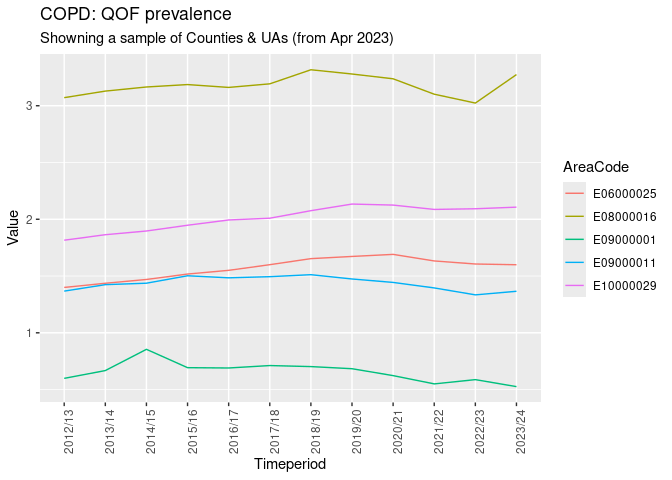

# Fingertips Data Exploration


``` r
remotes::install_github("rOpenSci/fingertipsR",
                        build_vignettes = TRUE,
                        dependencies = "suggests")
```

``` r
library(fingertipsR)
library(kableExtra)
library(tidyverse)
```

    ── Attaching core tidyverse packages ──────────────────────── tidyverse 2.0.0 ──
    ✔ dplyr     1.1.4     ✔ readr     2.1.5
    ✔ forcats   1.0.0     ✔ stringr   1.5.1
    ✔ ggplot2   3.5.1     ✔ tibble    3.2.1
    ✔ lubridate 1.9.4     ✔ tidyr     1.3.1
    ✔ purrr     1.0.2     
    ── Conflicts ────────────────────────────────────────── tidyverse_conflicts() ──
    ✖ dplyr::filter()     masks stats::filter()
    ✖ dplyr::group_rows() masks kableExtra::group_rows()
    ✖ dplyr::lag()        masks stats::lag()
    ℹ Use the conflicted package (<http://conflicted.r-lib.org/>) to force all conflicts to become errors

Downloading profile list

``` r
profile_lst <- profiles()
head(profile_lst)
```

    # A tibble: 6 × 4
      ProfileID ProfileName       DomainID DomainName                               
          <int> <chr>                <int> <chr>                                    
    1        18 Smoking Profile 1938132885 Key indicators                           
    2        18 Smoking Profile 1938132886 Smoking prevalence in adults             
    3        18 Smoking Profile 1938132900 Smoking prevalence in priority populatio…
    4        18 Smoking Profile 1938132887 Smoking related mortality                
    5        18 Smoking Profile 1938132888 Smoking related ill health               
    6        18 Smoking Profile 1938132889 Impact of smoking                        

Indicator list for Asthma domain (code `8000009`)

``` r
indicator_lst_asthma <- indicators(DomainID = 8000009)

indicator_lst_asthma |>
  kable()
```

| IndicatorID | IndicatorName | DomainID | DomainName | ProfileID | ProfileName |
|---:|:---|---:|:---|---:|:---|
| 90933 | Asthma: QOF prevalence | 8000009 | Asthma | 29 | Respiratory disease |
| 92780 | Hospital admissions for asthma (under 19 years) - registered population | 8000009 | Asthma | 29 | Respiratory disease |
| 93573 | Emergency hospital admissions for asthma in adults (aged 19 years and over) | 8000009 | Asthma | 29 | Respiratory disease |
| 93594 | Median length of stay (days) of emergency admissions to hospital for asthma in adults (aged 19 years and over) | 8000009 | Asthma | 29 | Respiratory disease |
| 93595 | Median length of stay (days) of emergency admissions to hospital for asthma (aged under 19 years) | 8000009 | Asthma | 29 | Respiratory disease |
| 93644 | Mortality rate from asthma | 8000009 | Asthma | 29 | Respiratory disease |
| 93790 | Patients with Asthma: review in the last 12 months (denominator incl. PCAs) | 8000009 | Asthma | 29 | Respiratory disease |
| 93791 | Patients with Asthma (6-19 yrs): Second-hand smoking status recorded in the last 12 months (denominator incl. PCAs) | 8000009 | Asthma | 29 | Respiratory disease |

Indicator list for Respiratory disease (code `29`)

``` r
indicator_lst_resp <- indicators(ProfileID = 29)

indicator_lst_resp |> 
  head(10) |> 
  kable()
```

| IndicatorID | IndicatorName | DomainID | DomainName | ProfileID | ProfileName |
|---:|:---|---:|:---|---:|:---|
| 253 | COPD: QOF prevalence | 8000003 | Key indicators | 29 | Respiratory disease |
| 1204 | Mortality rate from chronic obstructive pulmonary disease, all ages | 8000003 | Key indicators | 29 | Respiratory disease |
| 40701 | Under 75 mortality rate from respiratory disease | 8000003 | Key indicators | 29 | Respiratory disease |
| 90933 | Asthma: QOF prevalence | 8000003 | Key indicators | 29 | Respiratory disease |
| 92780 | Hospital admissions for asthma (under 19 years) - registered population | 8000003 | Key indicators | 29 | Respiratory disease |
| 93573 | Emergency hospital admissions for asthma in adults (aged 19 years and over) | 8000003 | Key indicators | 29 | Respiratory disease |
| 93574 | Emergency hospital admissions for pneumonia | 8000003 | Key indicators | 29 | Respiratory disease |
| 93575 | Emergency hospital admissions for respiratory disease | 8000003 | Key indicators | 29 | Respiratory disease |
| 93576 | Emergency hospital admissions for bronchiolitis in children aged under 2 years | 8000003 | Key indicators | 29 | Respiratory disease |
| 93577 | Emergency hospital admissions for COPD, all ages | 8000003 | Key indicators | 29 | Respiratory disease |

Selecting the codes for Respiratory profile

``` r
sel_indicator <- indicator_lst_resp |>
  pull(IndicatorID) 
```

Indicators are reported for different area types. The next code extracts
the area types for each indicator.

``` r
area_avail_ind <- do.call(bind_rows,lapply(sel_indicator,\(x) indicator_areatypes(IndicatorID = x)))
```

``` r
area_ty_lst <- area_types()
```

``` r
area_avail_ind_names <- area_avail_ind |>
  left_join(
    indicator_lst_resp |>
      select(IndicatorID, IndicatorName) |>
      unique(),
    by = join_by(IndicatorID)
  ) |> 
  left_join(
    area_ty_lst |> 
      select(AreaTypeID,AreaTypeName) |> 
      unique(),
    by=join_by(AreaTypeID)
  )

slice_sample(area_avail_ind_names,n = 15) |> select(-IndicatorID,-AreaTypeID)
```

    # A tibble: 15 × 2
       IndicatorName                                                    AreaTypeName
       <fct>                                                            <chr>       
     1 Smoking Prevalence in adults (aged 18 and over) - current smoke… CCGs (2021/…
     2 Mortality rate from COPD as a contributory cause                 England     
     3 Overweight (including obesity) prevalence in adults              ICBs, forme…
     4 Fuel poverty (low income, low energy efficiency methodology)     Lower tier …
     5 Mortality rate from COPD as a contributory cause                 CCGs (2021/…
     6 Smoking Prevalence in adults (aged 18 and over) - current smoke… Upper tier …
     7 Percentage of physically active adults                           Upper tier …
     8 Median length of stay (days) of emergency admissions to hospita… NHS regions…
     9 Mortality rate from chronic obstructive pulmonary disease, all … Government …
    10 Fuel poverty (low income, low energy efficiency methodology)     England     
    11 COPD: QOF prevalence                                             General Pra…
    12 Overweight (including obesity) prevalence in adults              Lower tier …
    13 Hospital admissions for asthma (under 19 years) - registered  p… Sub-ICB, fo…
    14 Mortality rate from pneumonia (underlying cause)                 Sub-ICB, fo…
    15 Fuel poverty (low income, high cost methodology)                 Upper tier …

Data for one indicator of the Respiratory profile

``` r
temp_data <- fingertips_data(
  IndicatorID = area_avail_ind$IndicatorID[1],
  AreaTypeID = area_avail_ind$AreaTypeID[1]
  )
```

``` r
# Code from vignette 
cols <- c("IndicatorID", "AreaCode", "ParentName", "Sex", "Timeperiod", "Value")

area_type_name <- table(temp_data$AreaType) # tally each group in the AreaType field

area_type_name <- area_type_name[area_type_name == max(area_type_name)] # pick the group with the highest frequency
area_type_name <- names(area_type_name) # retrieve the name

set.seed(1234)
samp_areas <- sample(temp_data$AreaCode |> unique(),5)


data <- temp_data[temp_data$AreaType == area_type_name & temp_data$AreaCode %in% samp_areas,
                  cols]
```

``` r
ggplot(data,aes(x = Timeperiod,y = Value, col = AreaCode ,group = AreaCode))+
  geom_line()+
  labs(title = area_avail_ind_names$IndicatorName[1])+
  theme(axis.text.x = element_text(angle = 90))
```


